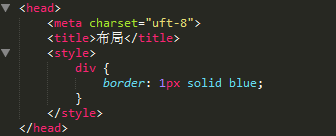

# HTML与盒模型

## HTML结构

```html
<!doctype html>
<html>
  <head>
    <meta charset="utf-8">
    <meta name="keyword" content="关键字">
    <meta name="description" content="描述">
    <meta http-equiv="content type" content="text/html" charset="uft-8">
    <meta http-equiv="refresh" content="20;url=http://www.baidu.com">
    <!-- 20秒后进入百度页面 -->
      <title>标题</title>
  </head>
  <body>
      

  </body>
</html>
```

!docment type：文档声明，避免盒模型出现怪异解析如ie浏览器下margin双边距问题。

HTML4.0的文档类型声明：3种  严格型、过渡型、框架型。

HTML5的文档类型：1种  HTML

meta，元信息，(utf-8)防止乱码

charset声明要放在title上面，以免title出现乱码

## 网页开发制作与开发流程

### 网页开发流程：

1. 切图，分析
2. 了解代码书写规范
3. 整体布局
4. 公共模块
5. 相似模块、普通模块
6. 网页的优化和细节方面的处理

### 标签、语义

```html
<div>div没有任何语义性，主要用于布局（每个div独占一行）</div>
<h1>标题<h1>
<p>段落</p>
```

### CSS

CSS（cascading Style Sheet）可译为层叠样式表或级联样式表，是一组格式设置规则，用于控制web页面的外观。

css的引入方式

标签内的书写：直接在标签里面添加style样式

```html
  <div style='border: 1px solid red;'>一个边框</div>
```

头部写入



```html
  在<head\>部分加入<style>标签，在<style>标签内部书写样式
```

外部引入


css三种引入方式优缺点

外部引入（优先级最低）

优点

1. 代码量少
2. 一个css文件可以控制多个页面
3. 有利于改版和维护
4. 有效的利用缓存机制，加快页面的访问速度
5. 肯能有seo的压力

缺点

1. 对于单页来说，会产生多余的代码
2. 外部引入中的href属性会给服务器造成请求压力

头部写入

优点

1. 代码量少。
2. 相对于整站来说，单页面代码量少
3. 没有服务器请求压力

标签内部写入

优点

1. 优先级最高
2. 个别特殊情况使用，网站维护中，如果不知道这串代码会不会导致别的修改。

### 路径

1. ../返回上一级，href="../css/index.css"
2. ./当前文件所在的层级（基本不用）
3. /根目录，D：/uxd/css/index.css，在D盘中任意一个文件夹href="/"这就代表D盘

### CSS代码基础语法

选择器 {属性：值；属性：值}

选择器通常是需要改变样式的HTML元素

每条声明由一个属性和值组成，每个属性有一个值，属性和值用：分开用;结束

例如：

```css
.wrap {
  width: 200px;
  height: 200px;
  margin: 100px;
  padding: 130px;
  background-color: #fcc;
}
```

其中margin和padding存在多种值类型

#### margin/padding

1个值上下左右

2个值上下、左右

3个值上、左右、下

4个值上、右、下、左

#### border：

```css
border-left: 10px solid green;
border-right: 10px solid green;
border-top: 10px solid green;
border-bottom: 10px solid green;
```

### CSS自身属性

#### 盒子模型

width             宽

height            高

margin           外边距

padding          内边距

border            边框

盒模型总宽度：margin-right/left、border-right/left、padding-right/left、width

盒模型总高度：margin-top/bottom、border-top/bottom、padding-top/bottom、width

### 显示属性

float: none|left|right;

float先浮后动：漂浮在上面的图层，当浏览器宽度不够，就会在下一行，水槽浮动原理

所有元素都可以浮动

没有特殊设置可以和文字一样大小的边框

### CSS选择器

CSS基本选择器：3种

1. id选择器：#开头，首字母不能是数字，且只能用一次 #wrap{border: 10px}优先级最高主要用于JS中
2. 类选择器：.开头，首字母不能是数字，可重复使用 .test{border： 10px}优先级第二
3. 标签选择器&lt;p&gt;、&lt;div&gt;标签
