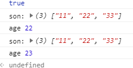
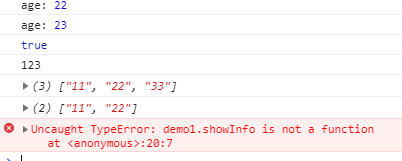
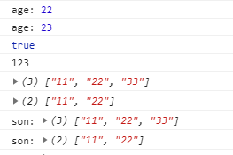

# 原型链

层层指向父原型的关系，可以用来查找对象之间的继承关系

三种方式

1. 简单继承
2. 借用构造函数继承
3. 组合模式的继承

## 简单继承

```js
  // 父类
  function Parent() {
    this.name = "123";
    this.friends = ["11", "22"];
  }
  Parent.prototype.showInfo = function() {
    console.log('parent:', this.friends);
  }
  // 子类
  function Son(age) {
    this.age = age;
  }
  // 继承
  // 子级的原型对象被父级的实例覆盖
  Son.prototype = new Parent();
  Son.prototype.showInfo = function() {
    console.log('son:', this.friends);
    console.log('age:', this.age)
  }
  //查找自己,往上以及查找原型对象，依次类推（作用域链一样）
  var demo1 = new Son(22);
  var demo2 = new Son(23);
  demo1.friends.push("33");
  console.log(demo1.showInfo == demo2.showInfo);
  demo1.showInfo();
  demo2.showInfo();
  // 不足之处：
  // 1、修改引用类型属性会影响到每个实例相应的属性（对象之间互相影响）
  // 2、子类创建的实例对象无法给父类的构造函数传递参数，导致每个实例的父类属性一样。
  // 优点
  // 1、方法的继承，共同使用同一个方法，每个实例公用同一个地址的方法
```



## 用构造函数实现继承

```js
function Parent() {
  this.name = "123";
  this.friends = ["11", "22"];
}
Parent.prototype.showInfo = function() {
  console.log('parent:', this.friends);
}
function Son(age) {
  Parent.call(this);
  this.age = age;
  console.log('age:', this.age)
}
var demo1 = new Son(22);
var demo2 = new Son(23);
demo1.friends.push("33");
console.log(demo1.showInfo == demo2.showInfo);
console.log(demo1.name); // 属性继承
console.log(demo1.friends);
console.log(demo2.friends);
demo1.showInfo(); // 报错 // 方法无法继承
demo2.showInfo(); // 报错
// 子类无法调用父类的方法，（方法无法继承）
// 如果要实现继承
// 如果方法要实现继承，需要放置够着函数当众，方法内存空间没有得到优化
// 优点，实现属性的继承（对象属性质检互不影响）
```



## 组合继承又名“伪经典继承”

通过构造函数实现对实例属性的继承

利用call循环的方法实现属性的继承，

利用for_in循环，用原型链继承的方法继承原来的所有方法。实现重写

```js
function Parent() {
  this.name = '123';
  this.friends = ['11', '22'];
};
Parent.prototype.showInfo = function() {
  console.log('parent:', this.friend);
};
function Son(age) {
  // 属性继承
  Parent.call(this);
  this.age = age;
  console.log('age:', this.age);
};
// 方法的继承
for (let i in Parent.prototype) {
  Son.prototype[i] = Parent.prototype[i];
};
Son.prototype.showInfo = function() {
  console.log('son:', this.friends);
};
var demo1 = new Son(22);
var demo2 = new Son(23);
demo1.friends.push('33');
console.log(demo1.showInfo == demo2.showInfo);
console.log(demo1.name);
console.log(demo1.friends);
console.log(demo2.friends);
demo1.showInfo();
demo2.showInfo();
```

